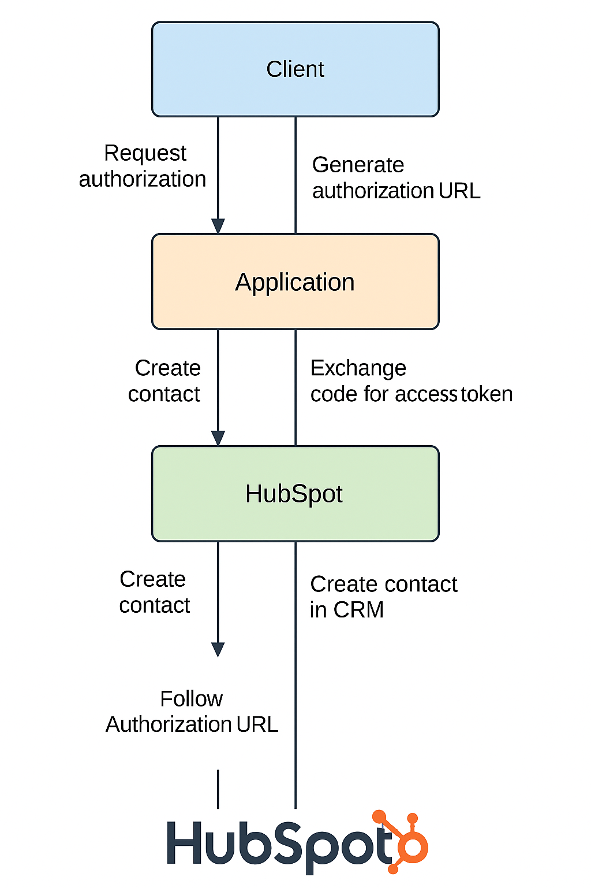
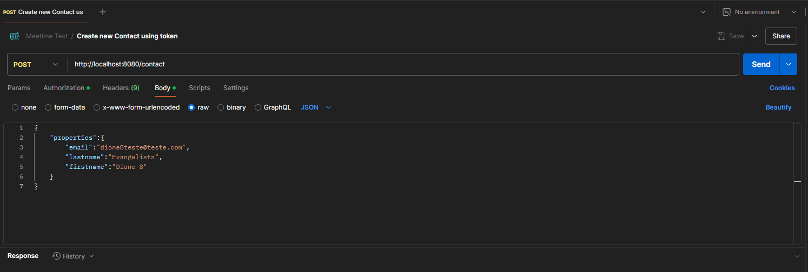
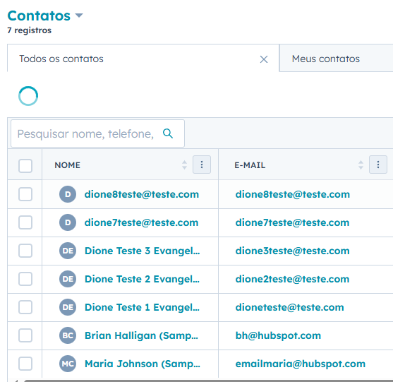
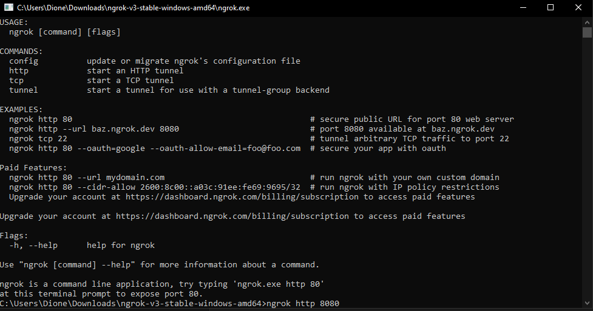
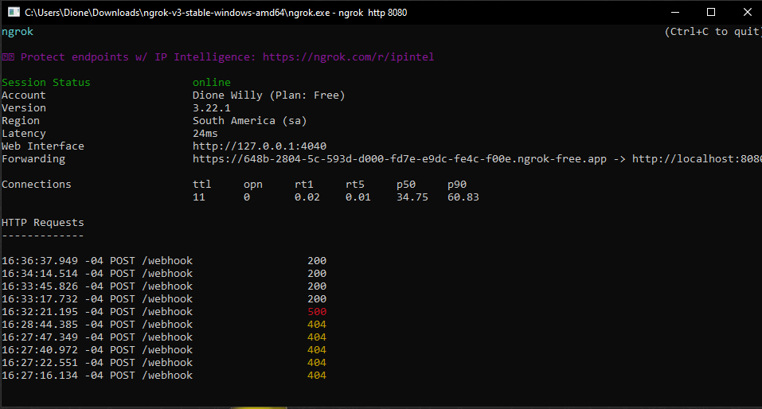
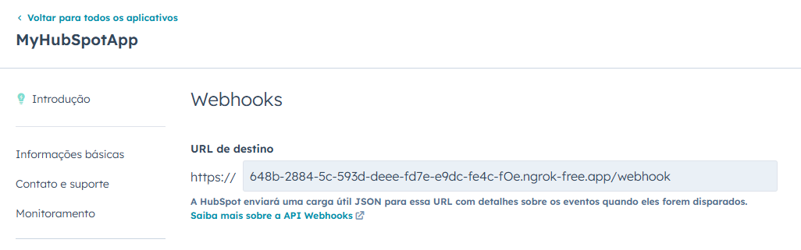
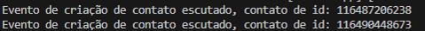

<!-- PROJECT LOGO -->
<br />
<div align="center">
    
<h1 align="center" id="tituloprojeto">Case Técnico - Integração com HubSpot</h1>
  <p align="center">
    Projeto de teste técnico API REST em JAVA + integração com plataforma Hubspot.
</div>

## :mag_right: Sobre o desafio
O projeto consiste na realização de um desafio técnico para vaga desenvolvedor back-end Java. O desafio consiste em desenvolver uma aplicação em linguagem de programação Java que seja capaz de integrar com a API do Hubspot, realizando requisição de autenticação, autorização utilizando OAuth 2.0 (authorization code flow), consumo do recurso com criação de contato e webhook para monitoração do evento.

Requisitos principais do desafio:
* Geração da Authorization URL.
* Processamento do Callback OAuth.
* Criação de Contatos.
* Recebimento de Webhook para Criação de Contatos.

## :gear: Tecnologias/Ferramentas usadas
Abaixo temos todas as tecnologias/ferramentas utilizadas durante o desenvolvimento da aplicação.
* [![Java][Java-badge]][Java-url]
* [![Spring Boot][SpringBoot-badge]][SpringBoot-url]
* [![SpringDoc][SpringDoc-badge]][SpringDoc-url]
* [![Maven][Maven-badge]][Maven-url]
* [![Postman][Postman-badge]][Postman-url]
* [![Ngrok][Ngrok-bagde]][Ngrok-url]


<p align="right">(<a href="#tituloprojeto">voltar ao topo</a>)</p>

## Sobre o Projeto

A aplicação foi desenvolvida em Java 21, utilizando o framework Spring Boot 3.4.4 e o gerenciador de dependências Maven. Para testes das requisições HTTP, foi utilizada a ferramenta gratuita Postman. Durante o desenvolvimento, o Ngrok foi utilizado para expor a API local para a internet, facilitando testes com serviços externos.
A documentação da API foi construída com Swagger, permitindo a visualização e teste dos endpoints de maneira interativa.




A estrutura da aplicação foi planejada para permitir a comunicação eficiente entre o cliente e a API do HubSpot, com o fluxo de autenticação e integração descrito abaixo:

* O cliente inicia o processo ao enviar uma requisição para o endpoint de autorização (/auth).
* A aplicação redireciona essa requisição para a plataforma HubSpot, com os dados necessários para autenticação.
* O cliente realiza o login na HubSpot e escolhe uma conta (de teste).
* O HubSpot retorna um código de autorização para a aplicação.
* A aplicação consome esse código e faz automaticamente a requisição por um token de acesso.
* Após a obtenção do token, o cliente pode realizar requisições autenticadas, como a criação de um novo contato (por exemplo, via Postman).
* A aplicação monitora o evento de criação de contato e registra as interações em uma lista para fins de controle e visualização.

### Dependências extras
Foram utilizadas algumas dependências extras para complementar o projeto e o desenvolvimento do código, sendo:

* Lombok (Biblioteca Java que serve para reduzir o código boilerplate)
* Swagger via SpringDoc (Biblioteca para criar a documentação da API REST)
* Webclient (Client HTTP reativo do Spring WebFlux, mais atualizado e de fácil utilização)
* Validation (Validação de Dados através de anotações para objetos em Java)

## :computer: Como iniciar o projeto
### :wrench: Pré-requisitos
Antes de rodar o projeto, é necessário ter as seguintes ferramentas instaladas:
* [Git](https://git-scm.com/downloads) (Verifique com: git --version)
* [Java](https://www.oracle.com/java/technologies/javase/jdk21-archive-downloads.html) (Verifique com: java -version)
* [Maven](https://maven.apache.org/install.html) (Verifique com: mvn -v)
* [Postman](https://www.postman.com/downloads/) (testar a API)

### :package: Instalação
1. **Clone o repositório**:
   ```bash
   git clone https://github.com/DioneDw/meetimeapp.git

2. **Acesse o diretório do projeto**
   ```bash
   cd meetime
3. **Instale as dependências:**
    ```bash
   mvn install
4. **Rodar o projeto localmente: Para rodar a aplicação localmente, você pode executar o comando:**
   ```bash
   mvn spring-boot:run

5. **Informe as variáveis de ambiente da sua aplicação no Hubspot**
Neste momento seria necessário já ter configurado as informações de autenticação do seu aplicativo no Hubspot.
   ```bash
   //No arquivo application-prd.properties temos as variaveis do ambiente.
   //Esses valores devem ser substituidos pelos valores de autorização da aplicação Hubspot a ser testada.
   auth.client-id: ${AUTH_CLIENT_ID}
   auth.client-secret: ${AUTH_CLIENT_SECRET}
   auth.redirect-uri: ${AUTH_REDIRECT_URI}
   auth.auth-url: ${AUTH_AUTH_URL}
   auth.scope: ${AUTH_SCOPE}

   oauth.base-url: ${OAUTH_BASE_URL}
   oauth.grant_type: ${OAUTH_GRANT_TYPE}
   oauth.client-id: ${OAUTH_CLIENT_ID}
   oauth.client-secret: ${OAUTH_CLIENT_SECRET}
   oauth.redirect-uri: ${OAUTH_REDIRECT_URI}
   ```

Para facilitar a demonstração, e como plataforma aberta será deixado como padrão no application.properties o perfil dev já com os valores da aplicação criada para o teste como default.
### :gear: Utilizando

A documentação da API foi feita utilizando swagger, sendo disponível tanto no endereço local: http://localhost:8080/swagger-ui/index.html#/ quando a aplicação está em execução, quanto disponível na versão de deploy da aplicação na plataforma render: [Render](https://meetimeapp.onrender.com/swagger-ui/index.html#/). Para testar com os dados personalizados do Hubspot é necessário estar rodando o projeto localmente e configurar as variáveis de ambientes indicadas acima.

O primeiro passo é realizar a **Requisição de autenticação ao Hubspot**, para isso basta acessar o endereço abaixo no rota /auth.
   ```bash
      http://localhost:8080/auth
   ```
Ao realizar a autenticação no site do Hubspot e selecionar o aplicativo seria retornado o token de acesso.

Com o token basta ir na ferramenta Postman fazer a requisição para a rota:
   ```bash
   // Requisição tipo POST, com cabeçalho Authorization Bearer <TOKEN> e corpo em JSON
      http://localhost:8080/contact
   ```
   Para facilitar essa requisição está em anexo a Collection do Postman com essa request montada, localizado na pasta **postman_collection**, arquivo: **meetime.postman_collection.json** na raiz do projeto.
   Substitua pelo token novo e pelos dados do contato.

(em caso de dúvidas consultar documentação Swagger em: http://localhost:8080/swagger-ui/index.html#/ ):



Caso o retorno seja positivo (201- Created), na plataforma Hubspot será possível ver na sua conta o contato criado com sucesso!



### Desafio
Para cumprir o último requisito do desafio houve um pequeno desafio pois a plataforma Hubspot não permite cadastrar um endereço não público como endereço para a função Webhook. Visando resolver essa situação foi optado utilizar a ferramenta [Ngrok](https://ngrok.com/) que permite o mapeamento de portas locais para um endereço público válido. O limitante é que este endereço funciona somente durante execução do ngrok.

 
 Criando expondo porta 8080 com Ngrok
   ```bash
   // Comando dentro do.exe ngrok
      ngrok http 8080
   ```
Exemplo tela Ngrok com requisições registradas (evento de criação de contato capturados durante testes):


&nbsp;&nbsp;&nbsp;

Cadastro webhook Hubspot:



Será necessário no aplicativo HubSpot cadastrar o endereço público atual para testar a captura do webhook na aplicação. O endpoint feito para realizar essa captura está descrito em detalhes na documentação Swagger:
   ```bash
      http://localhost:8080/webhook
   ```

Ao capturar o evento de criação de contato será printado no terminal do projeto local o ID do contato criado.




<p align="right">(<a href="#tituloprojeto">voltar ao topo</a>)</p>


Desta forma todos os 4 requisitos do desafio foram executados e a integração entre a API Rest e a plataforma foi realizada com sucesso.


## :email: Contato
Linkedin: https://www.linkedin.com/in/dione-evangelista/

GitHub: https://github.com/DioneDw
<p align="right">(<a href="#tituloprojeto">voltar ao topo</a>)</p>


[Java-badge]: https://img.shields.io/badge/Java-ED8B00?style=for-the-badge&logo=openjdk&logoColor=white
[Java-url]: https://www.java.com/

[SpringBoot-badge]: https://img.shields.io/badge/Spring_Boot-6DB33F?style=for-the-badge&logo=spring-boot&logoColor=white
[SpringBoot-url]: https://spring.io/projects/spring-boot

[SpringDoc-badge]: https://img.shields.io/badge/SpringDoc-6DB33F?style=for-the-badge&logo=spring&logoColor=white
[SpringDoc-url]: https://springdoc.org/

[Maven-badge]: https://img.shields.io/badge/Maven-C71A36?style=for-the-badge&logo=apache-maven&logoColor=white
[Maven-url]: https://maven.apache.org/

[Postman-badge]: https://img.shields.io/badge/Postman-FF6C37?style=for-the-badge&logo=postman&logoColor=white
[Postman-url]: https://www.postman.com/

[Ngrok-bagde]: https://img.shields.io/badge/Ngrok-1F1F1F?style=for-the-badge&logo=ngrok&logoColor=white
[Ngrok-url]: https://ngrok.com/
